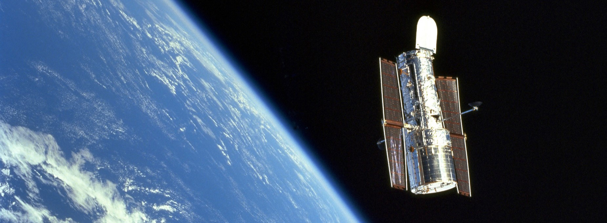

	

  
# ¡Hola! Soy Victoria Josefina Baza

*Estudiante secundaria en curso a recibirse de **Técnico Aviónico** y aspirante a **Ingeniera Aeroespacial***.

## Resumen rápido sobre mí

- Estoy en el 7mo Año en la **IMPA (E.E.S.T Nº7 T.R.Q.)**.
- Me interesan mucho las ciencias exactas, pienso estudiar **Ingeniería Aeroespacial** en la **Universidad de La Plata**.
- Participé en la **Olimpiada Matemática Argentina**, llegando hasta el *Certamen Provincial*.
- Socia activa de la **Asociación Argentina Amigos de la Astronomía**

## Idiomas

- **Español** *(Nativo)*
- **Inglés** *(Avanzado)*
- **Francés** *(Intermedio)*
- **Alemán** *(Básico)*

## *Now Playing...*

### 

 

