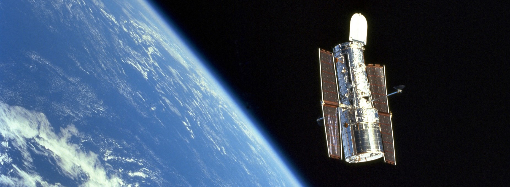

	

  
# ¡Hola! Soy Victoria Josefina Baza

*Estudiante de **Ingeniería Aeroespacial***.

## Resumen rápido sobre mí

- Soy estudiante de la Universidad Nacional de La Plata (UNLP)
- Me recibí de la **IMPA (E.E.S.T Nº7 T.R.Q.)**, como **Técnica Aviónica**.
- Participé en la **Olimpiada Matemática Argentina**, llegando hasta el *Certamen Provincial*.
- Socia activa de la **Asociación Argentina Amigos de la Astronomía**

## Idiomas

- **Español** *(Nativo)*
- **Inglés** *(Avanzado)*
- **Francés** *(Intermedio)*
- **Alemán** *(Básico)*

## *Now Playing...*

### 

 

